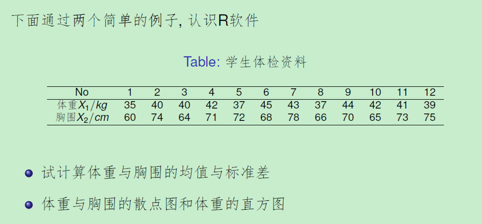
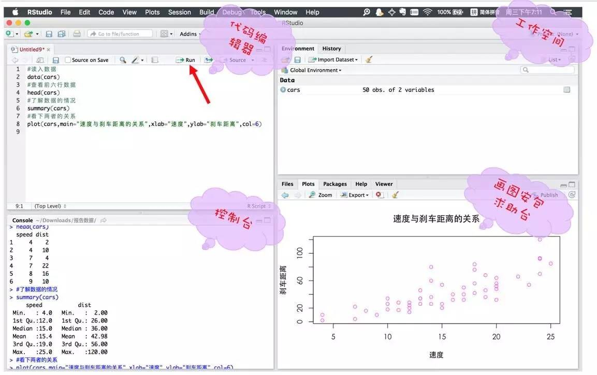

```{r setup, include=FALSE}
knitr::opts_chunk$set(echo = TRUE,eval=TRUE,message = FALSE, warning = FALSE)
```

# In this lecture we are going to learn ...

- How to install and use **R**
- **R** basics
- **R** coding style 
- Some nice **R** tips


#Why the software named as `R`?
<center></center>

# {.alert}
<br>
<br>
<center>How to install and use **R**</center>
                  
# Getting and Installing R

- Totally free!
- Download R on its [official website](https://www.r-project.org).   
   -R for Windows  
   -R for Linux  
   -R for Mac  
- Please install R in your own computer

# Examples 

## Example 1
Generate random samples of size $100$ from standard Gaussian distribution, and calculate its mean and standard derivation.  
```{r}
x<-rnorm(100,mean=0,sd=1)
mean(x)
sd(x)
summary(x)
```

- Some Remarks:  
    - Operation: `<-` (same as `=`)  
    - Functions  
        - `rnorm()`:   random data from normal distribution
        - `mean()`:    average of data
        - `sd()`:      standard derivation of data
        - `summary()`: Report minimum,25% quantile, median, 75% quantile and maximum of data

## Example 2

<center></center>

```{r}
##input and output data
X1<-c(35, 40, 40, 42, 37, 45, 43, 37, 44, 42, 41, 39)
X1
X2<-c(60, 74, 64, 71, 72, 68, 78, 66, 70, 65, 73, 75)
X2
##mean and sd of X1 and X2
mu1<-mean(X1)
mu1
sigma1<-sd(X1)
sigma1
mu2<-mean(X2)
mu2
sigma2<-sd(X2)
sigma2
##scatterplot&Histogram
plot(X1,X2)
par(mfrow=c(1,2))
hist(X1) # Histogram
hist(X1, probability = TRUE,main = paste("Histogram of" , "weight"),xlab = "weight")
lines(density(X1)) ##kernel
##list and data frame
student.list<-list(weight=X1,height=X2)
student.list  
student.df<-data.frame(weight=X1,height=X2)
student.df  
```

# Why use R?

- Acdemic research  
- Seeking job  
- Free, open-source integrated development environment (IDE) for R.  
- Rstudio: One of the most popular ways to run R.

<center></center>


# Packages required in this lecture
```
install.packages(c('foreign','MASS',`forecast`,'sos'))
```

#### R packages 

- Standard R comes with some standard packages installed for basic data management, analysis, and graphical tools.
- More than 10,000 packages available on CRAN! See http://cran.r-project.org.
- `install.packages('foreign')` to install an package called 'foreign'.
- `library(foreign)` before using the package.


# {.alert}
<br>
<br>
**R** basics

# Basic Operations

```{r}
# simple maths
1 + 2 + 3
1 + 2 * 3 

# assign a value to a variable
x <- 1
y <- 2
z <- c(x,y)
z

# function examples
exp(1)
cos(3.141593)
log2(1)
```


# Vectors

- Numerical vectors: `c()`,`rep()`,`seq()`   
- Logical vectors: `TRUE` or `FALSE`  
- Character vectors
- Length of a vector: `length(vector)`   
- Vector calculations: `+,-,*,/`  
- Extract some elements of a vector: `vector[location of elements]`  

```{r}
# vectors
c(0, 1, 1, 2, 3, 5, 8)
1:10
seq(1, 9, 2)
rep(1, 10)
length(rep(1, 10))

# character vectors
c("Hello world", "Hello R interpreter")

# vector calculation
c(1, 2, 3, 4) + c(10, 20, 30, 40)
c(1, 2, 3, 4) + 1

# you can refer to elements by location in a vector
b <- c(1,2,3,4,5,6,7,8,9,10,11,12)
length(b)
b
b[7]
b[1:6]
b[c(1,6,11)]
b > 5
b[b > 5]
```

# Matrix

- Create a matrix: `matrix()`
- Dimension of a matrix: `dim()`
- Transpose of a matrix: `t()`
- Extract elements from a matrix:`matrix[location of rows,locations of column]`  
- Combine two or more matrices: `rbind()`, `cbind()`

```{r}
# create a matrix
m <- matrix(c(1:6), 2, 3)
n <- matrix(c(8:13), 2, 3)
dim(m)
t(m)
m[1, 2]
m[1, ]
cbind(m, n)
rbind(m, n)
```

# List

- Special data structure that matrix could not handle.
    - Data length are not the same.
    - Data type are not the same.
- Create a list: `list()`
- Extract elements of a list: `[[]]` or `$`

```{r}
l <- list(a = c(1, 2), b = 'apple')
l
l$a
l$b
```

# Data frame

- `data.frame()`: tightly coupled collections of variables which share many of the properties of matrices and of lists, used as the fundamental data structure by most of R’s modeling software.
- In most cases, the operation with a data frame is similar to matrix operation.

```{r}
L3 <- LETTERS[1:3]
fac <- sample(L3, 10, replace = TRUE)
d <- data.frame(x = 1, y = 1:10, fac = fac)
d
```

- Some Remarks:  
    - Same length for each variable  
    - Use `d$x` to Extract elements of a data frame

# Data input and save

- Input data from  
    + `.txt` file: `read.table()` 
    + `.csv` file: `read.csv()`  
    + `.Rdata` file:`load()`  
- Other sources: need R package `foreign`
       * Excel file: First save data in `.txt` or `.csv`, then use `read.delim()` or `read.csv()`  
       * SPSS file: `read.spss()`  
       * SAS file: `read.xport()`  
       * S-PLUS file: `read.S()`  
       * Stata file: `read.dta()` 
- Data from packages: `data()`  
- Save data  
    + `.txt` file: `write.table()`  
    + `.csv` file: `write.csv()`  
    + `.Rdata` file: `save()`


```
##`.Rdata`
load('Data/example1_4.Rdata')
##`.txt`
read.table('Data/student_df.txt',header=TRUE)
read.table('Data/student_df1.txt',header=FALSE)
##'.csv'
mydata<-read.csv('Data/educ_scores.csv',header = TRUE);mydata
##Other sources
install.packages('foreign')
library('foreign')
####SPSS
scores.sav<-read.spss('Data/educ_scores.sav');scores.sav
##list,next is data.frame
scores.sav<-read.spss('Data/educ_scores.sav',to.data.frame=T);scores.sav
####SAS
scores.xpt<-read.xport('Data/educ_scores.xpt');scores.xpt
####S-PLUS
scores.S<-read.S('Data/educ_scores');scores.S
####Stata
scores.dta<-read.dta('Data/educ_scores.dta');scores.dta
####Excel
read.delim('Data/EDUC_SCORES.txt')
read.csv('Data/educ_scores.csv')
```
#Edit data

```
load('Data/example1_4.Rdata')
example1_4        #Full data
head(example1_4)  #First rows of data
tail(example1_4)  #Last rows of data
t(example1_4)     #Transpose 
```

```
#Read data from educ_scores.sav,and calculate the mean of each row and column 
scores.sav<-read.spss('Data/educ_scores.sav',to.data.frame=T);scores.sav
scores<-scores.sav[,2:4];scores
sum.col<-colSums(scores);sum.col
rbind(scores,col.Total=sum.col)
sum.row<-rowSums(scores);sum.row
cbind(scores,row.Total=sum.row)
##apply(scores,2,sum)
##apply(scores,1,sum)
```

Some useful functions:  
- `colSums()`  
- `rowSums()`  
- `colMeans()`  
- `rowMeans()`  
- `rbind()`  
- `cbind()`  
- `apply()`

#Random sampling
```
load("Data/example1_4.Rdata")
####Load the data in R
example1_4
####Data: Name & Score
#is.data.frame(example1_4)#####example1_4 is a data.frame

###Simple random sampling with replacement
sample(example1_4$姓名,10,replace = TRUE)
samp1<-sample(example1_4$姓名,10,replace = TRUE);samp1
###Simple random sampling without replacement
sample(example1_4$姓名,10,replace = FALSE)
samp2<-sample(example1_4$姓名,10,replace = FALSE);samp2

###分数的随机抽样
samp3<-sample(example1_4$分数,10,replace = TRUE);samp3
samp4<-sample(example1_4$分数,10,replace = FALSE);samp4

###姓名和分数同时抽样
index.replace<-sample(1:50,10,replace=TRUE)
samp.replace<-example1_4[index.replace,];samp.replace
index.nonreplace<-sample(1:50,10,replace=FALSE)
samp.nonreplace<-example1_4[index.nonreplace,];samp.nonreplace

```


# Functions 

- Create a function
```{r}
f <- function(x, y) {
  z <- c(x + 1, y + 1)
  return(z)
}
f(1, 2)
```
- Load the function: `source()`
- Execute your function

# The if condition
- Syntax
```
if (condition){
  do something
} else {
  do something
}
```
- Example
```{r}
x <- 0
if (x > 1) {
  print('x is larger than 1')
} else {
  print('x is not larger than 1')
}
```
# Loops

- Example
```{r}
x <- 1:10
for(i in x) {
  print(i^2)
}
```

# Your turn (1) ????

1. Write a function `MySummary()` where the input argument is x can be any vector and the output is a list that contains the basic summary (mean, variance, length, max and minimum values) of the vector you have supplied to the function.
2. Test your function with some vectors (that you make up by yourself).

# Answer (1)

```{r}
MySummary <- function(x){
  x.mean <- mean(x)
  x.var <- var(x)
  x.length <- length(x)
  x.max <- max(x)
  x.min <- min(x)
  x.summary <- list(mean = x.mean,
                    var = x.var,
                    length = x.length,
                    max = x.max,
                    min = x.min)
  return(x.summary)
}

# some tests
MySummary(c(1:10))
MySummary(seq(1, 100, 5))
```

# Another option of Answer (2)

```{r}
MySummary <- function(x){
  # firstly create a list
  x.summary <- list()
  # assigning values
  x.summary$mean <- mean(x)
  x.summary$var <- var(x)
  x.summary$length <- length(x)
  x.summary$max <- max(x)
  x.summary$min <- min(x)
  return(x.summary)
}

# some tests
MySummary(c(1:10))
MySummary(seq(1, 100, 5))
```

# {.alert}
<br>
<br>
**R** coding style

# File names 

- File names should end in .R and, of course, be *meaningful*. 
- GOOD: `predict_ad_revenue.R` 
- BAD: `foo.R`

# Choose the names of variables and functions carefully

#### What we should do

- The preferred form for variable names is all lower case letters and words separated with dots (variable.name), but variableName is also accepted. Generally, variable names should be nouns.
    - GOOD: avg.clicks 
    - OK: avgClicks 
    - BAD: avg_Clicks
- Function names have initial capital letters and no dots. Function names are mostly verbs.
    - GOOD: CalculateAvgClicks 
    - BAD: calculate_avg_clicks , calculateAvgClicks 
- Choose a consistent naming style

#### What we should not do

- Don't use underscores (_) or hyphens (-).
- Avoid using names of existing functions and variables like `mean', `median' etc.
- Avoid using meaningless names like a, b, c, ..., aa, bb, cc, ...


# White Spaces

- around operators (=, +, -, <-, etc)
- put a space after a comma, and never before

```{r}
x <- c(1:10)
x.average<-mean(x,na.rm=TRUE)
```

$\Rightarrow$

```{r}
x.average <- mean(x, na.rm = TRUE)
```

- split long lines at meaningful places

Don’t be afraid of splitting one long line into individual pieces!

```{r}
n <- matrix(sample(1:100, 9), nrow = 3, ncol = 3, byrow = TRUE)
```

$\Rightarrow$

```{r}
n <- matrix(sample(1:100, 9),
           nrow = 3,
           ncol = 3,
           byrow = TRUE)
```

# Curly braces
- An opening curly brace should never go on its own line and should always be followed by a new line. 
- A closing curly brace should always go on its own line, unless it’s followed by else.
- Always begin the body of a block on a new line.
- Always indent the code inside curly braces.

```{r}
if (y < 0) {print("y is negative")}
```
$\Rightarrow$
```{r}
if (y < 0) {
  print("y is negative")
}
```
# Indenting 

- Use two spaces
- Can help in detecting errors in your code because it can expose lack of symmetry
- Reindenting using RStudio


```{r}
if (y < 0) {
print("y is negative")
}
```
$\Rightarrow$
```{r}
if (y < 0) {
  print("y is negative")
}
```

# Make your code tidy in a second!

- Reformat and reindent in Rstudio.
- **formatR** package in **R**. You can even make a folder of `.R` files tidy using `tidy.dir()`.


# Header, Line spaces and Comments

- Add a Header for your file
- Add lots of comments
- Use blank lines to separate blocks of code and comments to say what the block does. Remember that in a few months, you may not follow your own code any better than a stranger.


```{r}
x <- c(1:10)
x.mean = mean(x)
x.var = var(x)
```

$\Rightarrow$

```{r}
# =============================================
# Title
# Author: Shanshan Wang
# Date: Mar 23, 2017
# Description: your purpose
# =============================================

x <- c(1:10)

# getting the mean of x
x.mean = mean(x)

# getting the variance of x
x.var = var(x)
```

# Function Documentation

- Functions should contain a comments section immediately below the function definition line. 
- These comments should include
    - a one-sentence description of the function
    - a list of the function's arguments, denoted by Args:, with a description of each (including the data type)
    - a description of the return value, denoted by Returns:. 
    - The comments should be descriptive enough that a caller can use the function without reading any of the function's code.

```{r}
CalculateSampleCovariance <- function(x, y, verbose = TRUE) {
  # Computes the sample covariance between two vectors.
  #
  # Args:
  #   x: One of two vectors whose sample covariance is to be calculated.
  #   y: The other vector. x and y must have the same length, greater than one,
  #      with no missing values.
  #   verbose: If TRUE, prints sample covariance; if not, not. Default is TRUE.
  #
  # Returns:
  #   The sample covariance between x and y.
  n <- length(x)
  # Error handling
  if (n <= 1 || n != length(y)) {
    stop("Arguments x and y have different lengths: ",
         length(x), " and ", length(y), ".")
  }
  if (TRUE %in% is.na(x) || TRUE %in% is.na(y)) {
    stop(" Arguments x and y must not have missing values.")
  }
  covariance <- var(x, y)
  if (verbose)
    cat("Covariance = ", round(covariance, 4), ".\n", sep = "")
  return(covariance)
}
```

# {.alert}
<br>
<br>
Some nice  **R** tips

# How to find the right function 

- Functions in installed packages

```{r, eval = FALSE}
library(forecast)
help.search("auto.arima")
??auto.arima
```
- Functions in other CRAN packages
 
```{r, eval = FALSE}
library(sos)
findFn("arima")
RSiteSearch("arima")
```
 


# Look at other people's codes 
- https://github.com/hadley
- https://github.com/yihui
- https://github.com/karthik
- https://github.com/kbroman
- https://github.com/cboettig
- https://github.com/garrettgman

# Getting help
- For programming questions: StackOverflow.com
- For statistical questions: CrossValidated.com

# Keep up-to-date
- RStudio blog: blog.rstudio.org
- R-bloggers: www.r-bloggers.com
- It takes time to develop your own style. Once it is developed, it is really hard to be changed. So please be careful at the beginning. 


    
# Your turn (2) ????

- Write a function to solve the roots of given quadratic equation $ax^2 + bx + c = 0$ with $a$, $b$ and $c$ as input arguments. 

- Test your function on some simple equations.

- Keep in mind the styles we have learnt.

# Answer (2)

```{r}
FindRoots <- function(a = 1, b = 1, c = 0) {
  # Computes the roots of a quadratic equation.
  #
  # Args:
  #   a: The coeffienct of x^2. Default is 1.
  #   b: The coeffienct of x. Default is 1.
  #   c: The constanct. Default is 0.
  #
  # Returns:
  #   Roots.
  if (b ^ 2 - 4 * a * c < 0) {
    return("No real roots")
  } else {
    root1 <- (-b + sqrt(b ^ 2 - 4 * a * c)) / (2 * a)
    root2 <- (-b - sqrt(b ^ 2 - 4 * a * c)) / (2 * a)
    roots <- c(root1, root2)
    return(roots)
  }
}

# some tests
FindRoots()   # using default values of arguments
FindRoots(1, 2, 0)
FindRoots(1, 2, 3)
```

# Your turn (3) ????

- Write two messy `.R` files and put them in a folder.
- Use `tidy.dir()` to make them tidy.


# References

- [Official introduction to R](https://cran.r-project.org/doc/manuals/R-intro.pdf)
- [Google R style guide](https://google.github.io/styleguide/Rguide.xml)
- [Rob's tips](http://robjhyndman.com/hyndsight/simpler/)

# Further readings
- [Hadley's style](http://adv-r.had.co.nz/Style.html)
